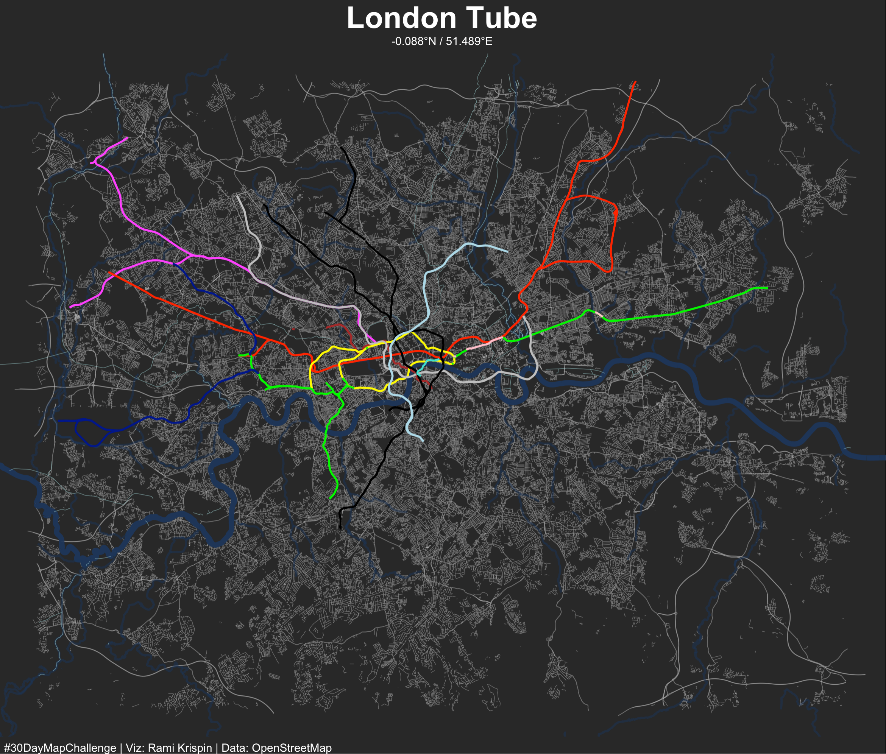

# 30 Day Map Challenge

Following the [#30DayMapChallenge](https://30daymapchallenge.com/)

### Day 1 | Points

### Day 2 | Lines

### Day 3 | Polygons

### Day 4 | Green

### Day 5 | Ukraine

### Day 6 | Network

### Day 7 | Raster

### Day 8 | OpenStreetMap

### Day 10 | Bad Map

### Day 11 | Red

### Day 12 | Scale

### Day 13 | 5 minute map

### Day 14 | Hexagons

### Day 16 | Minimal

### Day 18 | Colour Friday: Blue

### Day 21 | Data: Kontur Population Dataset

